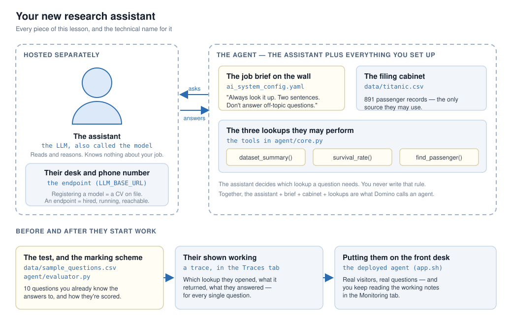

# Lesson 1 — Build your first agent in Domino

Host a model, give it tools, evaluate it, and deploy it as an agent that answers questions about the
Titanic passenger dataset.

**Time:** about 10 minutes, plus a few minutes the first time for the model endpoint to start.

## Three words you'll see throughout

| Term | What it means here |
| --- | --- |
| **LLM** (also called **the model**) | The thing that reads a question and writes an answer. Same thing, two names. |
| **Endpoint** | A running copy of that model with a URL you can call. The model can't be used until it has one. |
| **Agent** | The LLM *plus* the tools, instructions, and data you give it. The agent is what you build; the LLM is one part of it. |

## Mental model



You've hired an assistant (**the LLM**) who can read and reason but knows nothing about your job.
You give them a filing cabinet (**your data**), three lookups they're allowed to run (**tools**), and
a job brief on the wall (**your config**). That whole setup is **the agent**.

Before they meet anyone, you give them a test you already know the answers to (**your evaluation**)
and ask them to show their working on each question (**a trace**). If they pass, they go to the
front desk (**deployment**), and you keep reading their notes (**monitoring**).

## Repo layout

```
.
├── app.sh                       # command Domino runs to launch the deployed agent
├── ai_system_config.yaml        # prompt and model settings — logged as parameters on every run
├── requirements.txt
├── agent/
│   ├── core.py                  # the agent: LLM connection and three tools
│   └── evaluator.py             # scores each answer
├── app/server.py                # chat UI for the deployed agent
├── scripts/
│   ├── dev_eval.py              # batch evaluation over the test questions
│   └── run_eval.sh              # Job command: installs deps, runs dev_eval.py
└── data/
    ├── titanic.csv              # 891 passenger records
    └── sample_questions.csv     # 10 test questions with expected tool and answer
```

Paths resolve from the project root, so scripts behave the same in a Workspace, a Job, or the App.

---

## Step 1 — Create the project

**Projects → Create Project → Git-based → Input URL**, paste this repo's URL, and create. The
project's **Code** page should now list the files above.

## Step 2 — Host the model

**Register it.** **Models → Register → Gen AI model**, source **Hugging Face**, path
`Qwen/Qwen2.5-7B-Instruct`, Type **LLM**. Name it anything — Step 3 finds the served name for you.

**Deploy it as an endpoint.** From the model's **Endpoints** tab, **Create endpoint**:

- **Environment** → **Domino vLLM Environment** (serves an OpenAI-compatible API).
- **Hardware Tier** → a GPU tier with at least 16 GB VRAM for this 7B model.
- **Advanced → vLLM arguments** → `--enable-auto-tool-choice` and `--tool-call-parser hermes`.
- **Access** → add yourself and anyone else running the lesson.

> [!IMPORTANT]
> Those two vLLM arguments are what let the model call tools. Without them your agent has a brain
> but no hands, and every answer is a guess.

When the endpoint is running, copy the BASE_URL (in the **Code snippet** section) from the **Calling** tab.

> [!NOTE]
> Using an external provider such as OpenAI instead? Skip this step and use their base URL, key, and
> model name in Step 3. See
> [Set up LLM access](https://docs.domino.ai/cloud/platform-capabilities/features/llms/index) and
> [Host an LLM](https://docs.domino.ai/cloud/platform-capabilities/features/llms/host-an-llm).

## Step 3 — Point the agent at the endpoint

**Settings → Environment variables**, add `LLM_BASE_URL` with the BASE_URL you copied. That's usually the
only one you need.

- **No API key.** For a Domino-hosted endpoint, `agent/core.py` reads the token Domino serves at
  `http://localhost:8899/access-token`. External providers: set `LLM_API_KEY`.
- **No model name.** An endpoint serves the model under the name it was launched with, which is
  often not the Hugging Face path — a Domino endpoint commonly reports it as `.`. The agent asks the
  endpoint (`GET /v1/models`) and uses what it reports, which is what `name: auto` means in the
  config. Set `LLM_MODEL` only to pin a specific one.

## Step 4 — Run the agent

Launch a Workspace on the Domino Standard Environment, open a terminal:

```bash
pip install -r requirements.txt
python agent/core.py
```

It prints the model it resolved, then four answers and one refusal. Use `python agent/core.py
--models` to see what your endpoint serves.

> [!NOTE]
> Pip may print `ERROR: pip's dependency resolver...` about packages like `langchain-community`.
> Those conflicts already exist in the Domino Standard Environment and the install still succeeded.

## Step 5 — Evaluate it as a Job

Click **Run Job**, with `bash scripts/run_eval.sh` as the command.

All 10 questions in `data/sample_questions.csv` run, each becoming a trace scored by
`agent/evaluator.py`: did it pick the right tool, does the answer contain the right figures, is it
concise.

> [!IMPORTANT]
> Run it as a **Job**, not from the terminal. Only Job runs create a deployable agent version with
> lineage back to the exact commit and config.

## Step 6 — Review what you captured

**Experiments** → open the run:

- **Overview** → who ran it, when, on what hardware, from which Git commit.
- **Parameters** → your config, so you know what produced these numbers.
- **Metrics** → mean scores across all 10 questions.
- **Traces** → one row per question. Open one for the span tree: the LLM's tool choice, the tool call
  with its arguments and result, the final answer, plus tokens, latency, and cost.
- **Outputs** → artifacts the run produced.
- **Logs** → stdout and stderr, where you look when a run fails.

## Step 7 — Improve the prompt and compare

Your first run used the `baseline` prompt in `ai_system_config.yaml` — a reasonable first draft that
never mentions the tools. Switch to the `improved` one, which tells the agent to look everything up,
quote the figures, and refuse off-topic questions:

```yaml
prompt:
  active: improved     # was: baseline
```

> [!IMPORTANT]
> [Sync your changes](https://docs.domino.ai/cloud/platform-capabilities/core-concepts/workspaces/sync-changes-in-a-workspace#sync-all-changes)
> before starting the next Job, or it runs the old code.

Repeat Step 5, then select both agent versions in **Experiments** and click the **Compare** icon. The improved
prompt should score higher; the **Traces** comparison shows both versions answering the same
question side by side, so you can see *why* — figures quoted rather than recalled, and question 10
declined instead of answered.

> [!NOTE]
> Not every setting moves the needle. Changing `temperature` here produces near-identical scores,
> because each question has one obvious tool and the evaluator checks figures, not phrasing. That's
> a useful finding too.

## Step 8 — Deploy the winner

Open the better agent version → **Create Agent**, name it, set **Agent file** to `app.sh`. Then
**Deployments → Apps & Agents** → select it → **Deploy** with a small hardware tier.

Click **View Agent** and ask it a few questions. `app/server.py` uses the same tracing as the evaluation script, so live
conversations appear under **Monitoring**, alongside **Usage** and **Performance**.

> [!IMPORTANT]
> **Clean up:** stop the agent, your Workspace, and the model endpoint — the endpoint holds a GPU
> while it runs.

---

## How the tracing works

```python
# scripts/dev_eval.py
@add_tracing(name="titanic_question", autolog_frameworks=["pydantic_ai"], evaluator=judge)
def answer_question(data_point):
    return run_agent(data_point["question"])

with DominoAgentContext(agent_config_path="ai_system_config.yaml"):
    for row in questions:
        answer_question(row)
```

`@add_tracing` captures the call and every LLM and tool call beneath it, then runs `judge` on the
result. `DominoAgentContext` groups those traces into one agent version and logs your config as its
parameters.

This lesson uses Pydantic AI, but Domino auto-instruments any MLflow-supported framework — LangChain,
OpenAI Agents SDK, LlamaIndex — and traces look the same whether the model is hosted in Domino or by
an external provider.

## Coming up

- **Lesson 2 — the feedback loop:** LLM-as-judge evaluation and scoring production traces on a schedule.
- **Lesson 3 — multi-agent:** calling one agent from another, and what that looks like in a trace.

## Troubleshooting

| Symptom | Fix |
| --- | --- |
| Hugging Face model missing from the list | Accept the model's licence on Hugging Face first |
| Endpoint stuck on "Starting" | Hardware tier too small. Check endpoint logs, pick more VRAM |
| `LLM_BASE_URL is not set` | Add it in Step 3, then restart the Workspace — variables load at startup |
| `404 — The model 'X' does not exist` | Run `python agent/core.py --models` to see what's served. If `LLM_MODEL` is set to something else, clear it and restart |
| Answers without any tool call | The vLLM tool-calling arguments are missing — see Step 2 |
| No run in the Experiment Manager | It ran from a terminal. Run it as a Job |
| `ModuleNotFoundError: domino.agents` | Environment predates Domino 6.2. Add `RUN pip install "dominodatalab[agents]"` to its Dockerfile instructions and rebuild |

## Docs

- [Set up LLM access](https://docs.domino.ai/cloud/platform-capabilities/features/llms/index) ·
  [Host an LLM](https://docs.domino.ai/cloud/platform-capabilities/features/llms/host-an-llm)
- [Agents in Domino](https://docs.domino.ai/cloud/platform-capabilities/features/agents/index) ·
  [Agentic AI overview](https://docs.domino.ai/cloud/platform-capabilities/features/agents/agentic-ai-overview) ·
  [Develop agentic systems](https://docs.domino.ai/cloud/platform-capabilities/features/agents/develop)
- [Create and run Jobs](https://docs.domino.ai/6.3/platform-capabilities/core-concepts/jobs/create-and-run-jobs)
